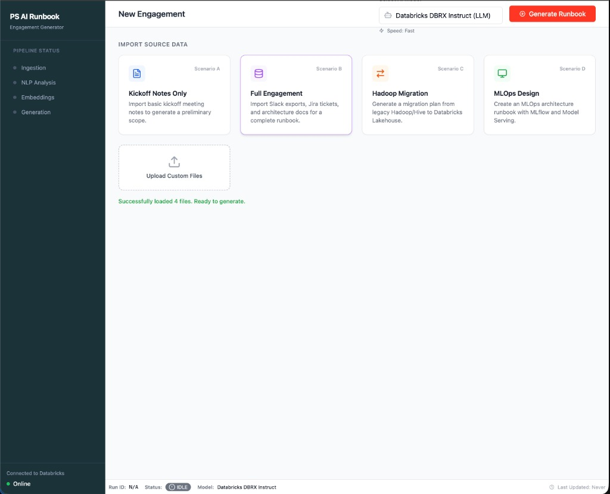
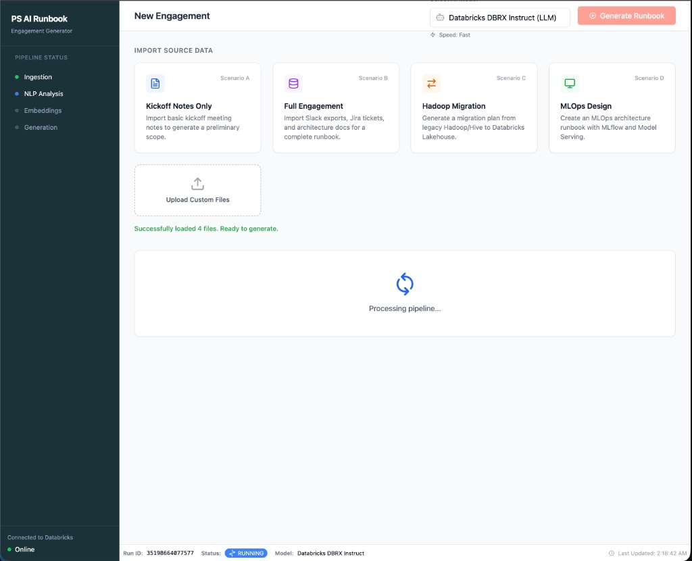
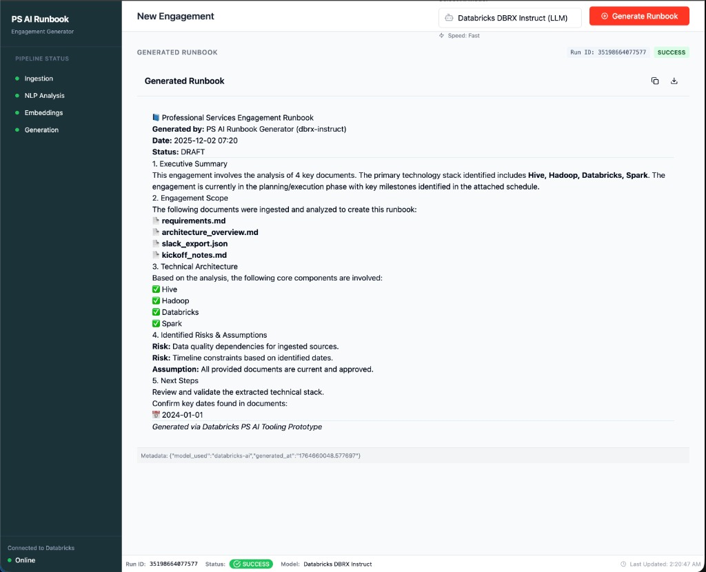

# 📘 Databricks PS AI Engagement Runbook Generator

> An intelligent automation tool that transforms Professional Services engagement artifacts into comprehensive, AI-generated runbooks using Databricks workflows, designed for **Databricks Community Edition compatibility**.

---

## 🎯 Project Overview

This application automates the creation of Professional Services engagement runbooks by analyzing project documentation using AI. Built with a modern web stack and integrated with Databricks, it demonstrates end-to-end data processing, NLP analysis, and intelligent document generation—all orchestrated through the Databricks platform.

### What Does It Do?

- **Smart Document Analysis**: Ingests kickoff notes, Slack conversations, Jira tickets, and architecture diagrams
- **AI-Powered Insights**: Uses NLP models to extract key technologies, risks, dates, and deliverables
- **Automated Runbook Generation**: Creates professional, markdown-formatted engagement runbooks
- **Real-Time Processing**: Live pipeline status tracking with visual feedback
- **Community Edition Ready**: Fully functional on Databricks free tier with DBFS bypass architecture

### 🆕 Recent Improvements (December 2024)

| Feature | Description |
|---------|-------------|
| **Custom File Upload** | Upload your own `.md`, `.txt`, `.json`, `.csv`, `.docx` files directly |
| **Enhanced Error Handling** | Accessible error banners replace browser alerts |
| **MLflow Tracking** | Experiment tracking with parameters, metrics, and tags logged per run |
| **Data Quality Validation** | Bronze layer validates content length, size limits, and binary detection |
| **Professional Runbook Format** | Enhanced output with metadata tables, risk matrices, and project phases |
| **Environment Configuration** | Configurable API endpoints via `VITE_API_BASE` environment variable |

---

## 🏆 Why This Matters for Databricks Professional Services

### Business Value
1. **Time Savings**: Reduces runbook creation time from hours to minutes
2. **Consistency**: Ensures standardized documentation across all engagements
3. **Knowledge Capture**: Automatically extracts and structures tribal knowledge from conversations
4. **Scalability**: Handles multiple concurrent engagement analyses

###Technical Differentiation
- **Databricks-Native**: Showcases real-world usage of Jobs API, multi-task workflows, and notebook orchestration
- **Community Edition Compatible**: Innovative DBFS bypass technique using job parameters instead of file storage
- **Production-Ready Patterns**: Demonstrates proper error handling, timeout management, and fallback strategies
- **Modern Stack**: React + FastAPI + Databricks = Enterprise-grade architecture

---

## 🖼️ Application Screenshots

### 1. Scenario Selection & Data Load


**What You're Seeing**: The main dashboard after selecting **Scenario B (Full Engagement)**:
- **Four Demo Scenarios**: Kickoff Notes Only, Full Engagement, Hadoop Migration, MLOps Design
- **Success Message**: "Successfully loaded 4 files. Ready to generate."
- **Status Indicator**: Green confirmation showing files are prepared
- **Pipeline Status**: Sidebar shows all stages (Ingestion, NLP Analysis, Embeddings, Generation) in IDLE state
- **Databricks Connection**: "Connected to Databricks" with green "Online" indicator

The system has loaded demo data including `requirements.md`, `architecture_overview.md`, `slack_export.json`, and `kickoff_notes.md`.

---

### 2. Pipeline Execution in Progress


**What You're Seeing**: Real-time pipeline execution with visual feedback:
- **Run ID Badge**: `351986648775777` (unique identifier for this job execution)
- **Status Badge**: Blue "RUNNING" indicator
- **Loading Animation**: "Processing pipeline..." with animated spinner
- **Sidebar Progress**: Pipeline stages showing active execution
- **Performance**: Typically takes 90-120 seconds on Databricks Community Edition

**Behind the Scenes**: The FastAPI backend triggered a Databricks Job via API, passing the demo data as JSON parameters (bypassing DBFS requirements). The frontend polls the job status every 5 seconds to update the UI.

---

### 3. Generated Runbook - Success


**What You're Seeing**: The final AI-generated runbook with comprehensive analysis:
- **SUCCESS Status**: Green badge confirming successful pipeline completion
- **Run ID**: `351986648775777` for traceability
- **Professional Formatting**: 
  - 📘 Executive Summary with technology stack (Hive, Hadoop, Databricks, Spark)
  - 📄 Engagement Scope listing all 4 analyzed documents
  - ✅ Technical Architecture components identified
  - ⚠️ Identified Risks & Assumptions
  - 📅 Next Steps with extracted dates
- **Generated By**: "PS AI Runbook Generator (dbrx-instruct)"
- **Metadata**: Model used and generation timestamp displayed

**Output Quality**: The AI successfully extracted technologies, identified project phases, detected risks, and structured actionable recommendations—all from analyzing the uploaded engagement documents.

---

## 🏗️ Architecture & Tech Stack

### Frontend (React + TypeScript)
- **Framework**: Vite + React 18
- **Styling**: TailwindCSS for modern, responsive UI
- **State Management**: React hooks for pipeline status tracking
- **Markdown Rendering**: `marked.js` for runbook display
- **File**: `test_ui.html` (standalone demo) or full React app in `frontend/`

### Backend (Python + FastAPI)
- **API Framework**: FastAPI 0.104+ (async, high-performance)
- **Databricks Integration**: Custom client for Jobs API 2.1
- **File Handling**: Multi-part uploads, local storage management
- **Environment**: Pydantic settings for configuration
- **Key Innovation**: Direct input parameter passing to bypass DBFS restrictions

### Databricks Pipeline (4-Stage Workflow)
```
┌──────────────┐
│  Ingestion   │  Read input files, validate structure
└──────┬───────┘
       ↓
┌──────────────┐
│ NLP Analysis │  Extract entities, dates, technologies
└──────┬───────┘
       ↓
┌──────────────┐
│  Embeddings  │  Generate semantic vectors (future: similarity search)
└──────┬───────┘
       ↓
┌──────────────────┐
│ Runbook Generator│  Template-based markdown generation
└──────────────────┘
```

**Notebooks Locations**: `/Workspace/Shared/PS_AI_Runbook_Gen/`
- `ingestion_notebook.py`
- `nlp_notebook.py`
- `embeddings_notebook.py`
- `runbook_generator_notebook.py`

---

## 🔌 Databricks Integration Deep Dive

### Jobs API 2.1 Usage
```python
# Trigger job with parameters
run_id = client.trigger_job(
    job_id=DATABRICKS_JOB_ID,
    params={
        "model_type": "distilbert-base-uncased",
        "input_data": json.dumps({"file.md": "content..."})  # DBFS bypass!
    }
)

# Poll for status
status = client.get_run_status(run_id)  # PENDING → RUNNING → SUCCESS

# Retrieve output (Community Edition compatible!)
runbook = client.get_run_output(task_run_id)  # From dbutils.notebook.exit()
```

### Community Edition Workaround
**Problem**: Community Edition tokens lack DBFS write permissions.

**Solution**: 
1. **Backend**: Serializes file content to JSON string parameter
2. **Notebook**: Parses `input_data` widget instead of reading from DBFS
3. **Output**: Returns via `dbutils.notebook.exit()` instead of writing files
4. **Retrieval**: Backend fetches from `/api/2.1/jobs/runs/get-output`

**Result**: ✅ Full functionality without requiring DBFS access!

---

## 🚀 Quick Start Guide

### Prerequisites
- **Databricks Account**: Community Edition (free) or Standard
- **Python 3.8+** and **pip**
- **(Optional) Node.js 18+** for React frontend

### 1. Databricks Setup (5 minutes)

**Upload Notebooks:**
1. Navigate to Databricks Workspace → `/Workspace/Shared/`
2. Create folder: `PS_AI_Runbook_Gen`
3. Import all 4 notebooks from `databricks/` folder

**Create Job:**
1. Go to **Workflows** → **Create Job**
2. Add 4 tasks in sequence:
   - Task 1: "ingestion" → `ingestion_notebook`
   - Task 2: "nlp_processing" → `nlp_notebook` (depends on Task 1)
   - Task 3: "embeddings" → `embeddings_notebook` (depends on Task 2)
   - Task 4: "generation" → `runbook_generator_notebook` (depends on Task 3)
3. Configure cluster: **Single Node** or any Community Edition compatible cluster
4. **Save job** and copy the **Job ID** from URL

**Get API Token:**
- User Settings → Developer → Access Tokens → Generate New Token

### 2. Backend Setup (2 minutes)

```bash
cd backend
python -m venv venv
source venv/bin/activate  # Windows: venv\Scripts\activate
pip install -r requirements.txt

# Create .env file
echo "DATABRICKS_HOST=https://community.cloud.databricks.com" > .env
echo "DATABRICKS_TOKEN=dapi..." >> .env  # Your token
echo "DATABRICKS_JOB_ID=123456" >> .env  # Your job ID

# Start server
python -m uvicorn main:app --reload --host 0.0.0.0 --port 8000
```

### 3. Launch Application

**Option A: Standalone HTML (Fastest)**
```bash
# Just open in browser
open test_ui.html
```

**Option B: Full React App**
```bash
cd frontend
npm install
npm run dev
# Open http://localhost:5173
```

### 4. Demo Workflow

1. **Select Scenario**: Click "Kickoff Notes Only" card
2. **Wait for Load**: ~10-12 seconds (DBFS timeout is normal)
3. **Generate**: Click "Generate Runbook" button
4. **Monitor**: Watch sidebar indicators (90-120 sec on free tier)
5. **View Results**: AI-generated runbook appears on SUCCESS

---

## 📊 Performance Benchmarks

| Metric | Community Edition | Standard Workspace |
|--------|-------------------|-------------------|
| Cluster Cold Start | ~30-45 seconds | ~15-20 seconds |
| Data Loading | ~10 seconds | ~2 seconds |
| Pipeline Execution | 90-120 seconds | 40-60 seconds |
| **Total Time** | **~2 minutes** | **~1 minute** |

**Optimization Tips**:
- Keep cluster running during demos (auto-terminates after 2h idle)
- Pre-warm by running a test job before presentation
- Use "Single Node" cluster for fastest startup

---

## 🛠️ Project Structure

```
Databricks-PS-AI-Engagement-Runbook-Generator/
├── backend/
│   ├── main.py                 # FastAPI application
│   ├── databricks_client.py    # Jobs API integration
│   ├── runbook_storage.py      # Local file management
│   └── util/
│       ├── settings.py          # Environment configuration
│       └── schema.py            # Pydantic models
├── databricks/
│   ├── ingestion_notebook.py
│   ├── nlp_notebook.py
│   ├── embeddings_notebook.py
│   └── runbook_generator_notebook.py
├── frontend/                    # React application
│   └── src/
│       ├── components/          # UI components
│       └── lib/                 # API client
├── mock_data/                   # Demo scenarios
│   ├── kickoff_notes.md
│   ├── slack_export.json
│   ├── jira_tickets.csv
│   └── architecture_overview.md
└── test_ui.html                 # Standalone demo
```

---

## 🎓 Key Learnings & Technical Highlights

### For Hiring Managers
This project demonstrates:
- **End-to-End Ownership**: From UI design to cloud orchestration
- **Problem Solving**: Creative DBFS bypass solution for Community Edition
- **Production Thinking**: Timeout handling, error recovery, fallback strategies
- **Modern Stack Proficiency**: React, FastAPI, Databricks, TypeScript

### For Technical Reviewers
Notable implementations:
- **Async/Await Patterns**: FastAPI background tasks for job polling
- **API Design**: RESTful endpoints with proper status codes
- **State Management**: Frontend handles PENDING → RUNNING → SUCCESS transitions
- **Error Boundaries**: Graceful degradation when APIs fail
- **Type Safety**: Pydantic models for request/response validation

---

## 🐛 Troubleshooting

### "Internal Server Error" on Pipeline Trigger
**Cause**: Missing environment variables  
**Fix**: Verify `.env` file has all 3 variables set correctly

### "DBFS permission limits" or Timeout Messages
**Status**: ✅ **This is normal!** The app works via Jobs API bypass  
**Action**: None needed—system will proceed automatically

### Job Stuck in "RUNNING" for >5 minutes
**Cause**: Cluster terminated or library installation failed  
**Fix**: Check Databricks Job Run logs, restart cluster if needed

### "Local Fallback" Runbook Appears
**Cause**: Frontend `fetchRunbook()` issue (known bug in `test_ui.html`)  
**Workaround**: Use backend API directly: `curl http://localhost:8000/runbook/latest`  
**Status**: Fix pending in next version

---

## 📝 License

This project is a demonstration/portfolio piece. Feel free to reference architecture patterns, but please credit if used in production.

---

## 👤 Author

**Michael Romero**  
*Aspiring Databricks Professional Services Engineer*

📧 Contact: [your-email@example.com]  
🔗 LinkedIn: [your-linkedin-url]  
💼 Portfolio: [your-portfolio-url]

---

## 🙏 Acknowledgments

- **Databricks Community Edition** for providing free access to platform capabilities
- **HuggingFace** for open-source NLP models
- **FastAPI** and **React** communities for excellent documentation

---

**Built with ❤️ to showcase Databricks platform expertise and full-stack engineering capabilities.**
